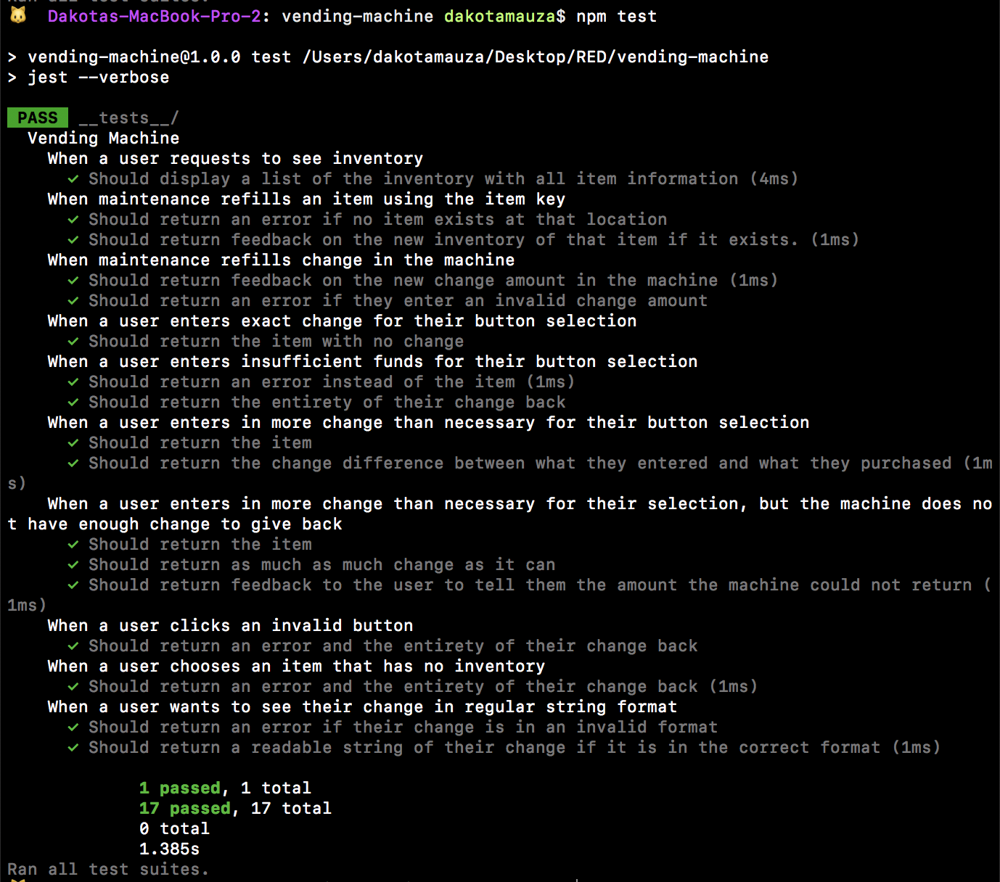

# Vending Machine

Vending machine written in vanilla JS with functionality to print the inventory, refill inventory, re-supply change in the machnine, dispensing inventory based on payment and returning change as coins in the smallest denomination possible. Currently entirely test-driven, no UI (yet!). See test results in image below.

## Features

* Uses Jest for TDD, first time implementing describe and it scenarios.
* Vending machine written as a Javascript class.
* Brings in mock data from a JSON file to use for testing.

## Set Up

`git clone https://github.com/DakotaPaige/vending-machine.git`

`npm test` in vending-machine directory
